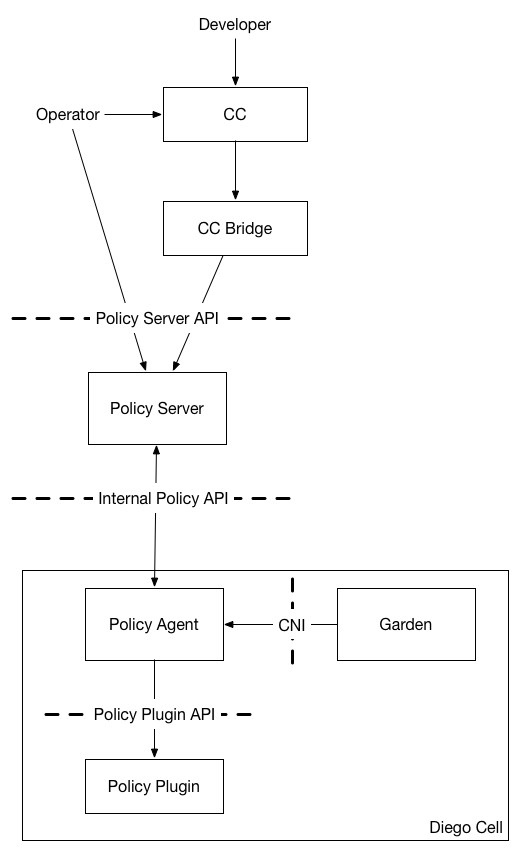

* some very rough notes on how we might implement policy in an extensible way *



## Policy Server API

- POST `/app`
  * as the CC bridge, I POST to this endpoint on the Policy Server to register a new app *
  Request:
  ```
  { 
    "guid": "db8e8142-3d4e-413f-99ef-f2a9f644e1b1"
  }
  ```
  Response:
  ```
  { 
    "guid": "db8e8142-3d4e-413f-99ef-f2a9f644e1b1",
    "wire_bytes": "a7e0cd35"
  }
  ```

- POST `/whitelist`
  * as an operator or automated component I POST to this endpoint on the Policy Server to allow traffic between two apps *
  Request:
  ```
  { 
    "source": "db8e8142-3d4e-413f-99ef-f2a9f644e1b1",
    "destination": "55c21794-95a8-41bc-b320-3f79540a6789"
  }
  ```
  
## Policy Agent API
- GET `/app/:app_guid/whitelist`
  * as the policy agent running on a diego cell, when a new app with `:app_guid` is created on my cell,
    then I GET from this endpoint on the Policy Server that I will use to discriminate between packets on the wire
  Response:
  ```
  {
    "allowed_wire_bytes": [
      "a7e0cd35",
      "7578a0fa"
    ]
  }
  ```
  
## Policy Plugin API
- POST `/whitelist`
  * as the policy agent running on a diego cell, when a new app with `:app_guid` is created on my cell,
    I POST to this endpoint on the policy plugin in order to tell it about a new ethernet device on the system
  Request:
  ```
  {
     "destination_device": {
       "namespace": "/var/vcap/data/ducati/sandboxes/vni-42",
       "interface_name": "g-db8e81423d4e"
     },
     "allowed_wire_bytes": {
       [
        "a7e0cd35",
        "7578a0fa"
       ]
     }
  }
  ```
